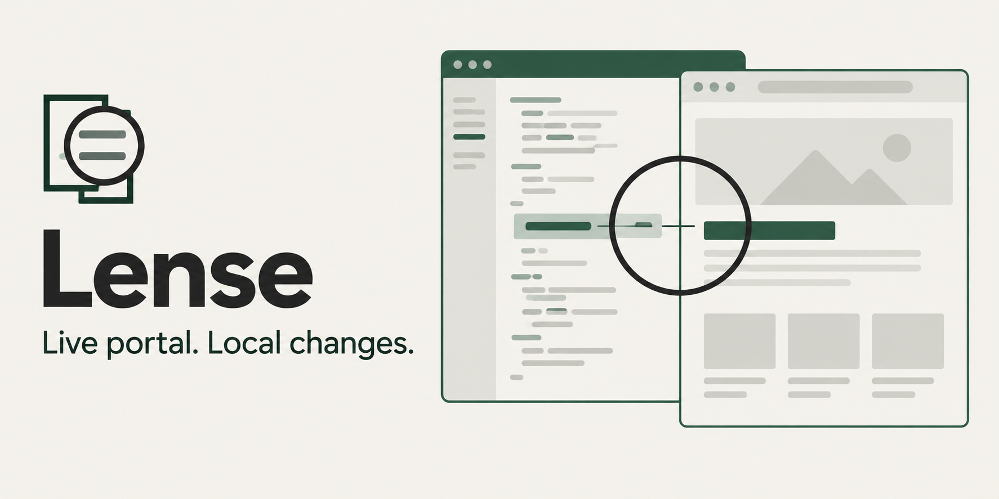

# Lense



Lense provides Power Pages-aware resource overrides for pro-code development. Preview local JavaScript, CSS, images and supported literal HTML edits on a live site; the online backend continues to run Liquid and Dataverse.

If you use Fiddler AutoResponder or browser DevTools Local Overrides, Lense adds export-based mappings, record and field identity, Git baseline comparisons and live reload. See the [workflow comparison](../README.md#beyond-fiddler-and-devtools-overrides).

For installation and a first catalogue, follow [getting started](getting-started.md). The examples here run from your portal project with Paqvilo already installed.

## Your edit-preview loop

```sh
# Check the selected target and source mapping offline:
npx --no-install paqvilo lense doctor --config ./paqvilo.config.yml --site portal --env dev

# Open the configured online environment with local overlays:
npx --no-install paqvilo lense dev --config ./paqvilo.config.yml --site portal --env dev
```

1. Sign in through the portal's own sign-in action with your intended account.
2. Open the panel with **Alt+Shift+P** and check the selected site and environment.
3. Save a supported local change. Relevant pages refresh; CSS can hot-swap.
4. Inspect applied resources, diagnostics and failed requests, then switch **Online / Local** to compare responses.

Close the dedicated browser or use Ctrl+C to end the dev session. Browser interactions use the online backend and can affect live data; use authorized environments and actions.

## What can I preview?

| Change | What to expect |
| --- | --- |
| JavaScript, CSS or an image | Browser response overlays from discovered source mappings |
| Supported literal HTML or inline fields | Baseline patches where the match is unambiguous |
| Liquid logic, server-side settings or Dataverse behavior | Still evaluated by the online portal; use your separate deployment process where needed |
| Exported server-side rendering with local data | Use [Mirage](../mirage/README.md) to explore supported local simulation |

## Commands at a glance

Run `npx --no-install paqvilo lense --help` for the full command/options reference.

| Command | Purpose |
| --- | --- |
| `list`, `use` | Inspect available targets and remember a personal site/environment |
| `doctor` | Check configuration, source mapping, Solution inputs and baseline offline |
| `map`, `resources` | Discover online-to-local mappings and editable source descriptors |
| `audit --all --strict` | Independently inventory exports and expose blocked or unaccounted code |
| `dev` | Open a dedicated browser, apply local overlays and watch saves |
| `status` | Compare local resources with authenticated online responses |
| `verify` | Edit a disposable copy and check the browser applies supported changes |
| `agent` | Inspect and control a running owned browser through the bounded authenticated API |

In npm release 0.9.2, `doctor` can report missing Mirage dependencies even when local rendering works. Use `mirage inspect` to check the export; the source-checkout `npm run setup` instruction does not apply to your portal project.

## Source mapping and comparison scope

JavaScript, CSS, images and supported inline fields map from discovered export metadata. Literal markup uses baseline patches and rejects ambiguous matches. Lense does not evaluate Liquid locally or apply server-side portal settings. Enhanced XML and code-bearing YAML fields are edited using their discovered field/JSON descriptors; `source-edit.mjs` preserves sibling values and rejects stale identity or paths outside the source extract.

The default scope overlays every local source. `--scope changed` limits overlays to changes since the captured baseline. HEAD is pinned when a target activates; committing later does not erase the baseline. Explicit deployment refs remain explicit. The panel reports Git drift and can pin a fresh HEAD. Shared sources refresh the affected portal's tabs; page sources affect that page; CSS can hot-swap. Pausing reload preserves an unsaved form while saves accumulate.

The panel's **Online / Local** switch compares the browser's responses. **Alt+Shift+P** opens the panel. **Inspect** is available for live and Mirage sessions. **Tweaks** changes local Mirage identity and scenarios. Independent targets stay isolated by origin, environment and source selection.

In **Inspect**, start with **Page & templates** to open the page copy, JavaScript, CSS and template include chain. **Forms & controls** connects exported forms, lists, views and fields with rendered controls. **Select an element** identifies a control and shows an exact field match when one is available; unmatched elements point you to the page sources. Source rows open files in your configured editor.

Native grids trace their selected views, relationships, action settings and modal forms. Quick views link to their FormXml. Observed Web API requests identify entity sets without collecting record IDs or query values; Solution metadata resolves their table bindings.

With only a portal export, Inspect resolves portal components, snippets, web files and exported access rules. Add `mirage.solutionRoots` or `mirage.project` to the catalogue to resolve Solution FormXml, views, table fields and mapped PCF manifests and resources. These shared source settings also work in live Lense without starting Mirage. **Refresh inspection** rereads the selected sources, including Solution changes.

**Tables & access** shows exported permissions, scopes, relationships and web roles. Static references can include conditional branches. Rendered controls and assets are labelled separately. Live role membership and effective record access remain unknown; an exported grant is not proof that the signed-in user can use it.

## Automation and evidence

Agent discovery files contain bearer tokens and stay under ignored `.paqvilo/agents`. Use `agent sessions` to locate a session; `status`, `pages`, `events`, `state`, `snapshot` and `screenshot` inspect it. Page IDs are different from offline resource IDs. Agent control is origin-confined and has no arbitrary evaluation or proxy endpoint. Consume `nextSequence` and report dropped events.

Inspect applied resources, unmatched markup patches, deployment requirements, errors and failed requests after refresh. Audit coverage reports source classification, not successful navigation or browser application. A sign-in page is not successful target coverage. `verify --signed-in` requires closing the matching dev identity first; headed sign-in can be bounded with `--sign-in-timeout`.

Continue with [configuration](configuration.md), [project extensions](project-extensions.md) or the [documentation index](index.md).
