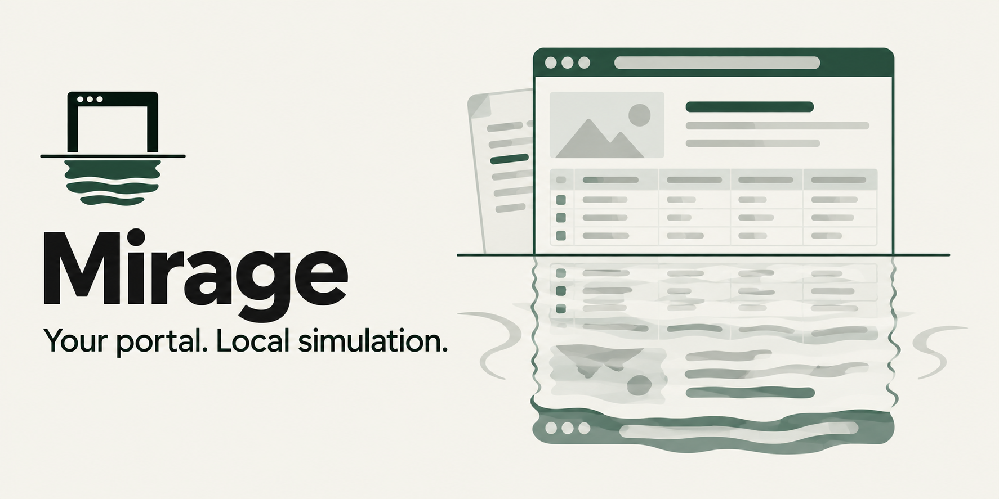

# Mirage



Mirage is Paqvilo's local-first Power Pages simulation engine. Run exported Liquid-based sites on your machine with simulated Dataverse, independent developer runtimes and repeatable test data.

Mirage derives forms, lists, settings and permissions from exported sources and Solution metadata. Your project's registered data packs supply personas, datasets and simulated business rules.

[First local portal](../docs/getting-started.md#try-the-included-example) | [Configuration](../docs/configuration.md) | [Runtime reference](docs/README.md)

## Start your workspace

Install Paqvilo and configure your export using [getting started](../docs/getting-started.md), then run from your portal project:

```sh
npx --no-install paqvilo mirage init --config ./paqvilo.config.yml --site portal
npx --no-install paqvilo mirage dev --config ./paqvilo.config.yml --site portal
```

Open the panel with **Alt+Shift+P**. **Inspect** connects the current page to its templates, forms, tables, permissions, snippets and settings. **Tweaks** controls your browser's local persona, enforcement and scenarios. Visit `/_sim/` for local administration.

New states contain exported configuration and empty business tables. Use [data scaffolding](../docs/getting-started.md#3-work-locally-with-mirage) for generated rows or a [data pack](docs/data-packs.md) for your own scenarios. The portal starts anonymous; sign in locally before testing protected pages.

## Pick the session that fits

| Command | Session behavior |
| --- | --- |
| `init` | Write a per-site runtime project from your catalogue |
| `dev` | Start local runtimes and open the integrated browser; stop newly started runtimes when this dev session ends |
| `start` | Start owned runtimes in the background |
| `status`, `stop` | Inspect or stop background sessions in the same project scope |
| `serve` | Run a foreground runtime without the integrated browser; stop with Ctrl+C |

```sh
npx --no-install paqvilo mirage status --config ./paqvilo.config.yml --json
npx --no-install paqvilo mirage stop --config ./paqvilo.config.yml --site portal

# Direct foreground runtime without the Lense browser:
npx --no-install paqvilo mirage serve --source ./portal-export --solution-root ./solutions/Core --port 0
npx --no-install paqvilo mirage inspect --source ./portal-export --json
```

Run lifecycle commands with the same catalogue or `--project` used to start the session. A runtime already running before `dev` keeps running when its browser closes. Multi-portal catalogues support one runtime per site and selector navigation; each site has isolated state and a session cookie.

## Build scenarios you can repeat

Local identity comes from a per-runtime cookie. The `_sim` session and Lense Tweaks control only that browser's identity. Your project tests can use the public [session helpers](testing/session.mjs) to sign requests or browser contexts in explicitly. The [project starter](../examples/project/README.md) demonstrates an external pack and a test against invented sources.

## Understand the simulation boundary

Local `_sim` changes affect simulated data, permissions, settings, scenarios and runtime providers. Live-reference reads and cached assets are explicit operations with separate provenance. Live writes remain disabled unless the runtime flag and administration switch both permit them; neither is authorization to perform a business operation.

Local rendering is a simulation; claim parity only for recorded reference comparisons. See [documentation](docs/README.md), [project extension guidance](../docs/project-extensions.md), and [migration](MIGRATION.md).
